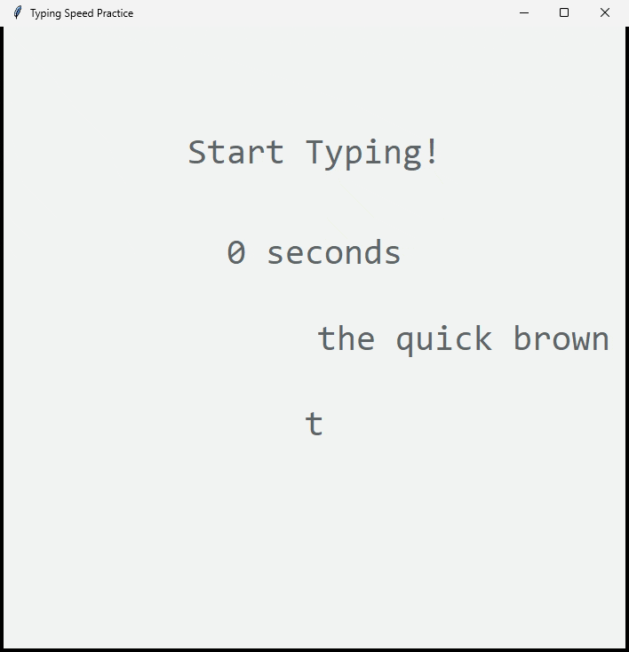

# TypeGame

My attempt at recreating a simple typing test, which grabs a random quote from a csv file and challenges you to type it as fast as you can.

Start typing when you're ready, ends when the quote is over or you press Enter.

Keeps track of mistakes, time taken, and your highest wpm score.

Built using Python.

